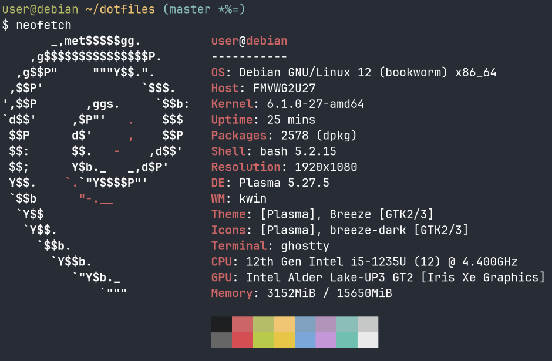

```
__  __          __      _ ____  ____  ____  __ __ _      
\ \/ /_  ______/ /___ _(_) __ \( __ )/ __ \/ // /( )_____
 \  / / / / __  / __ `/ / / / / __  / / / / // /_|// ___/
 / / /_/ / /_/ / /_/ / / /_/ / /_/ / /_/ /__  __/ (__  ) 
/_/\__,_/\__,_/\__,_/_/\____/\____/\____/  /_/   /____/  
                                                         
       __      __  _____ __         
  ____/ /___  / /_/ __(_) /__  _____
 / __  / __ \/ __/ /_/ / / _ \/ ___/
/ /_/ / /_/ / /_/ __/ / /  __(__  ) 
\__,_/\____/\__/_/ /_/_/\___/____/  
                                    
```



# Environment
- OS: Debian GNU/Linux 12
- Shell: Bash
- Desktop environment: KDE Plasma 5
- Terminal emulator: Ghostty
## My favorite tools
### Editor
I mainly use VSCode for development, but I switch editors depending on my mood.  
I love monokai colorscheme.  

- Visual Studio Code(mainly used)
- Vim
- Neovim
  - using LazyVim
- Zed
### TUI tools
- Lazygit(Git TUI)
- Lazydocker(Docker TUI)
- Yazi(File manager)
### System monitor
- htop
- bottom
### Other tools
- OBS
- VLC media player
- GIMP

# Install to machine
```
curl https://raw.githubusercontent.com/yudai0804/dotfiles/master/scripts/install.sh | bash
```

# Install for Docker

This Docker image applies these dotfiles.
https://hub.docker.com/repository/docker/yudai0804/dotfiles-debian/general

## How to use
```
docker run -it yudai0804/dotfiles-debian:latest bash
```

## Build && Run

```
docker compose
docker run -it dotfiles-yudai0804-debian bash
```

# Note

## Generate SSH key
```
mkdir -p ~/.ssh
cd ~/.ssh
ssh-keygen -t rsa
```
そしたらid_rsa.pubをGitHubに追加する。
GitHubで追加するときはauthenitiaciton Keyを選ぶ

## Install VSCode
```
./scripts/install-vscode.sh
```

## Install Docker
Debianの場合
```
./scripts/install-docker-debian.sh
```
Ubuntuの場合
```
./scripts/install-docker-ubuntu.sh
```

## Install Yazi
Yaziの公式バイナリはビルドに最新のUbuntuを使っている都合ため、Ubuntu22.04などを使おうとするとglibcのバージョンが異なって、使えない。その場合は自分でYaziをソースからビルドする必要がある。  

glibcのバージョンに関するissue: https://github.com/sxyazi/yazi/issues/2346

yaziのビルド方法: https://yazi-rs.github.io/docs/installation

## Install Nerd font
```
./scripts/install-nerd-font.sh
```

## Install Ghostty
Ubuntuの場合
```
/bin/bash -c "$(curl -fsSL https://raw.githubusercontent.com/mkasberg/ghostty-ubuntu/HEAD/install.sh)"
```
参考: https://github.com/mkasberg/ghostty-ubuntu

Debianの場合

https://github.com/clayrisser/debian-ghostty/

## Install Google Chrome
```
./scripts/install-google-chrome.sh
```

## Install WezTerm
```
curl -fsSL https://apt.fury.io/wez/gpg.key | sudo gpg --yes --dearmor -o /etc/apt/keyrings/wezterm-fury.gpg
echo 'deb [signed-by=/etc/apt/keyrings/wezterm-fury.gpg] https://apt.fury.io/wez/ * *' | sudo tee /etc/apt/sources.list.d/wezterm.list
sudo apt update && sudo apt install -y wezterm
```

## Install OBS
```
sudo add-apt-repository ppa:obsproject/obs-studio

sudo apt install obs-studio
```

## Install VLC media player
```
sudo apt install -y vlc
```

## Install GIMP
```
sudo apt install -y gimp
```

## Install Zed
```
curl -f https://zed.dev/install.sh | sh
```

