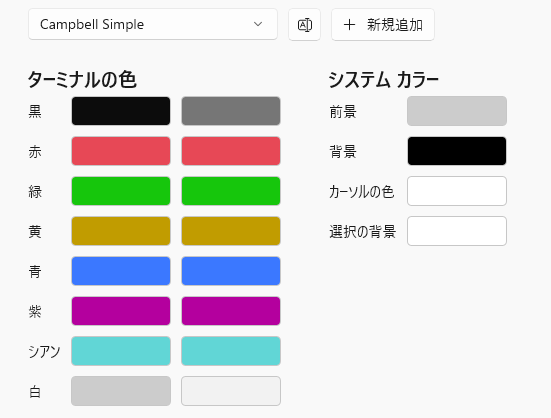

# 対応環境
- Ubuntu
  - WSLの場合、vimとWindowsのクリップボードの共有をするためにはひと手間必要。
  - このdotfilesはクリップボードの共有には非対応。
  - Windows Terminalを使っている場合、Ctrl+Shift+cやCtrl+Shift+vが使えるので、クリップボードの共有ができなくても問題ないはず。
- i3wm(Endeavour OS)
  - install.shは非対応。
  - dotfiles自体は使える。(一部壊れてるかも)

dotfilesには
- zsh+NeoVim(LazyVim)のモダンなもの
- bash+Vimのシンプルな構成のもの
の2種類が含まれています。
最近は後者のシンプルな構成のものをメインで使っています。

# gitのアカウントを設定する
手順的には設定しなくても大丈夫だが、インストールに失敗したときに、gitconfigがコピーされてしまって面倒なので事前に設定しておいた方がいい。
```
git config --global user.name "My Name"
git config --global user.email myname@example.com
```

## ssh key生成手順
```
cd ~/.ssh
ssh-keygen -t rsa
```
そしたらid_rsa.pubをGitHubに追加する。
GitHubで追加するときはauthenitiaciton Keyを選ぶ

# インストール
インストールされるものはinstall.shを読んでください。
```
git clone git@github.com:yudai0804/dotfiles.git
cd dotfiles
./scripts/install.sh
```
# Windows Terminal
Widows Terminalのデフォルトの配色(Cambell)だと明るい(太字)の青や紫は見やすいが普通の青や紫が見づらい。
青や紫を見やすくした以下のcolorschme(Cambell Simple)を使うとよい。
settings.jsonのcolorschmeのところにコピーすれば使える。
```
        {
            "background": "#000000",
            "black": "#0C0C0C",
            "blue": "#3B78FF",
            "brightBlack": "#767676",
            "brightBlue": "#3B78FF",
            "brightCyan": "#61D6D6",
            "brightGreen": "#16C60C",
            "brightPurple": "#B4009E",
            "brightRed": "#E74856",
            "brightWhite": "#F2F2F2",
            "brightYellow": "#F9F1A5",
            "cursorColor": "#FFFFFF",
            "cyan": "#61D6D6",
            "foreground": "#CCCCCC",
            "green": "#16C60C",
            "name": "Campbell Simple",
            "purple": "#B4009E",
            "red": "#E74856",
            "selectionBackground": "#FFFFFF",
            "white": "#CCCCCC",
            "yellow": "#F9F1A5"
        }
```
Campbell


Cambell Simple
普通の色も見やすい明るい色と同じ色にした



